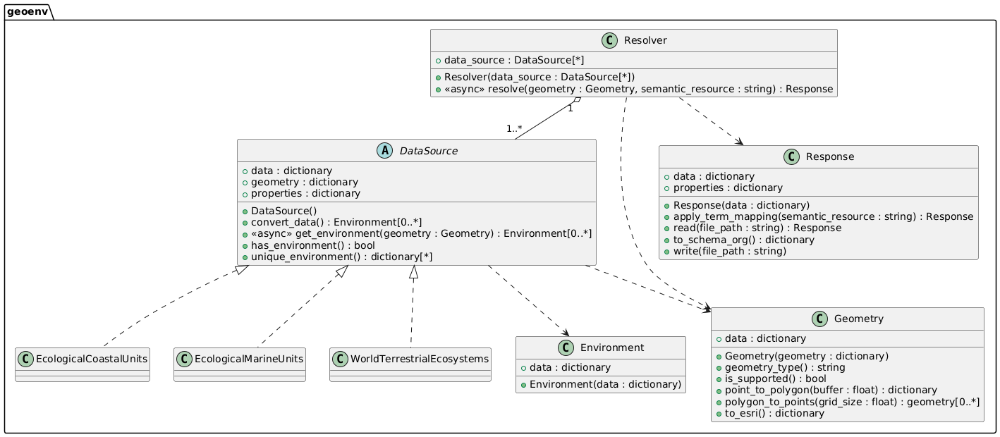

.. _design:

Project Design
==============

Welcome to the design guide for `geoenv`! This page provides an overview of the architecture, components, and principles that shape the project. Our goal is to make `geoenv` intuitive to understand and easy to contribute to.

Have suggestions or questions? Open a `GitHub issue <https://github.com/clnsmth/geoenv/issues>`_ —we'd love your feedback!

Project Overview
----------------

`geoenv` resolves geographic locations (as geometries) into meaningful environmental descriptions using spatial datasets 🌍 and semantic vocabularies 📖.

To make this possible, we designed around a clear set of priorities:

Functional Goals
~~~~~~~~~~~~~~~~

- Resolve spatial geometries to detailed environmental descriptions
- Support key, high-value spatial data sources
- Efficiently iterate over large numbers of geometries
- Enable dynamic data source selection
- Maintain traceability via location identifiers

Interoperability
~~~~~~~~~~~~~~~~

- Use open, widely adopted standards
- Map terms to multiple ontologies and vocabularies
- Output data in GeoJSON-compatible format
- Convert to `Science-On-Schema.Org`_ `Spatial Coverage`

Efficiency
~~~~~~~~~~

- Process multiple data sources in parallel using asynchronous requests
- Cache responses to avoid redundant queries
- Cache data sources locally where possible

Sustainability
~~~~~~~~~~~~~~

- Use pluggable `DataSource` implementations
- Promote community-driven growth

Architecture
------------

The system is composed of core classes that collaborate using clearly defined contracts. The architecture 🏗 follows a **strategy pattern** for modular extensibility.

Resolver
~~~~~~~~

The `Resolver` is the main entry point. You pass in a `Geometry` and a list of `DataSource` instances, and get back a structured `Response`:

- Calls all configured data sources concurrently using asynchronous I/O
- Wraps results into `Environment` objects
- Maps terms to `ENVO`_ by default
- Returns a `Response` object with the result set

Response
~~~~~~~~

The `Response` structures results using a GeoJSON format, where environmental descriptions are stored under `properties.environment`.

You can:

- Map terms to other vocabularies
- Convert the response to `Science-On-Schema.Org`_
- Save or load the result for reuse

DataSource (ABC)
~~~~~~~~~~~~~~~~

Defines the interface for any data source:

- Standard methods and properties for consistency
- Custom behaviors for data source-specific needs
- May implement fallback behavior (e.g., point approximation for polygons)

Returns an `Environment` for each query.

Environment
~~~~~~~~~~~

Encapsulates the returned values from a data source:

- Lightweight, minimal post-processing
- Includes original terms

Geometry
~~~~~~~~

Handles all client-supplied geometries in GeoJSON:

- Identifies type (Point, Polygon)
- Converts points to polygons
- Transforms to formats required by a data source

Supports GeoJSON `Point` and `Polygon` types for now, with plans for `GeometryCollections`.

Response Data Format
--------------------

The output is a GeoJSON `Feature` with nested environmental data. 📦

**Top Level:**

- **type** (string): always "Feature"
- **identifier** (string): unique ID for the query
- **geometry** (object): the original geometry
- **properties** (object): extra metadata, including environments

**Properties:**

- **description** (string): the geometry description
- **environment** (array): the resolved environments

**Environment Object:**

- **type** (string): always "Environment"
- **dataSource** (object): ID and name of the source
- **dateCreated** (string): timestamp of the query
- **properties** (object): key/value pairs of environmental properties
- **mappedProperties** (array): label/uri pairs for semantic mappings

**Example**

.. code-block:: json

    {
      "type": "Feature",
      "identifier": "...",
      "geometry": {...},
      "properties": {
        "description": "...",
        "environment": [
          {
            "type": "Environment",
            "dataSource": {
              "identifier": "...",
              "name": "..."
            },
            "dateCreated": "...",
            "properties": {
              "temperature": "Warm Temperate",
              "moisture": "Dry",
            },
            "mappedProperties": [
              {"label": "temperate", "uri": "..."},
              {"label": "arid", "uri": "..."}
            ]
          }
        ]
      }
    }

Semantic Mapping
----------------

We use `SSSOM <https://mapping-commons.github.io/sssom/>`_ to link data source terminology to semantic vocabularies. 🧠

- Mapping logic lives in ``Response.apply_term_mapping``
- Each data source has SSSOM files for each ontology/vocabulary

Error Handling
--------------

Error Propagation
~~~~~~~~~~~~~~~~~~

- Raised at the relevant layer 🚨
- Always include actionable info ✅

Logging with daiquiri
~~~~~~~~~~~~~~~~~~~~~

- Supports DEBUG, INFO, WARNING, ERROR
- Logs include relevant metadata

Testing
-------

We ensure test 🧪 coverage through:

- **Geometry tests** – validation, conversions, type detection
- **DataSource tests** – standard contract + edge cases
- **Response tests** – semantic mapping and transformation checks
- **Mock tests** – generated from real HTTP requests
- **Integration tests** – Resolver end-to-end scenarios

Adding a New Data Source
------------------------

**Data Source**

1. Add a module under `data_sources/`
2. Register it in `data_sources/__init__.py`
3. Implement the `DataSource` ABC
4. Support all required geometry types
5. Document special behaviors or config options
6. Keep data source-specific utilities scoped to the module

**Semantic Mappings**

1. Create SSSOM files for your vocabularies
2. Follow filename conventions for discovery

**Tests**

1. Create mock geometries
2. Use `create_mock_data.py` to record responses
3. Add tests for both valid and invalid inputs
4. Test both expected and edge behavior

`We're building geoenv to be sustainable, useful, and open. Your input helps shape its future 💚`

.. _ENVO: https://sites.google.com/site/environmentontology/
.. _Science-On-Schema.Org: https://github.com/ESIPFed/science-on-schema.org/blob/main/guides/Dataset.md#spatial-coverage